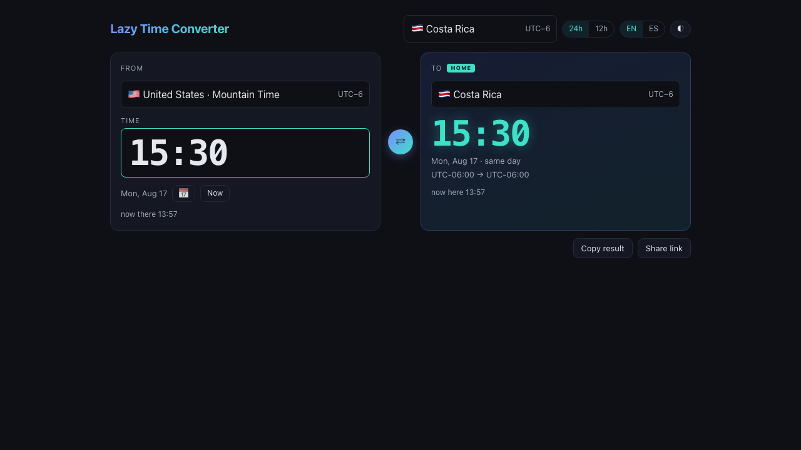

# Lazy Time Converter

A small, modern browser tool that converts a wall-clock time between the user's **home** time zone (auto-detected from the browser, editable) and a specific **country · time zone** anywhere in the world — in either direction. Canonical use: "I'm in Costa Rica, a meeting is at 15:30 US Mountain — what time is that for me?" and the reverse.

## Live

`https://<your-github-username>.github.io/lazy-time-conversor/`

(Goes live once the repository is pushed to GitHub and *Settings → Pages* is set to **Source: GitHub Actions**.)



## Features

- Convert `time (+ optional date)` from `country/zone A` to `country/zone B`, DST-correct, for any tz-database zone.
- Home zone auto-detected, overridable, remembered.
- Modern, friendly UI: two-card From/To layout with a swap button; searchable country·zone picker; live "now" clocks; 24h/12h; EN/ES; light/dark/system theme; copy result; shareable URL; recent conversions.
- Static site, zero backend, zero runtime dependencies for time math and names (native `Intl`). Catalog data generated at build time and committed.
- Deployed to GitHub Pages by GitHub Actions; every push runs typecheck + tests + build + catalog-drift check + browser smoke before deploy.

## How it works

- Conversion and zone/country names come from the browser's `Intl` API — no date library.
- The country → zone catalog (244 countries, 305 zones) is generated at build time from `@vvo/tzdb` into `src/domain/catalog.generated.json` and committed.
- Everything runs client-side; the only persistence is `localStorage` (home zone, theme, language, recents).

## Development

| Command | What it does |
|---|---|
| `npm run dev` | Vite dev server |
| `npm run verify` | Typecheck + unit/acceptance tests (152 tests, 23 files) — the definition of done |
| `npm run e2e` | Playwright smoke suite against a production preview build |
| `npm run gen:catalog` | Regenerate `src/domain/catalog.generated.json` from `@vvo/tzdb` |
| `npm run catalog:check` | Regenerate the catalog and fail if it differs from the committed file |

## Updating time-zone data

```bash
npm i -D @vvo/tzdb@latest && npm run gen:catalog && npm run verify
```

Commit the regenerated `src/domain/catalog.generated.json`.

## Docs

- [Design spec](docs/superpowers/specs/2026-08-17-lazy-time-converter-design.md)
- [Implementation plan](docs/superpowers/plans/2026-08-17-lazy-time-converter-implementation.md)

## License

MIT
